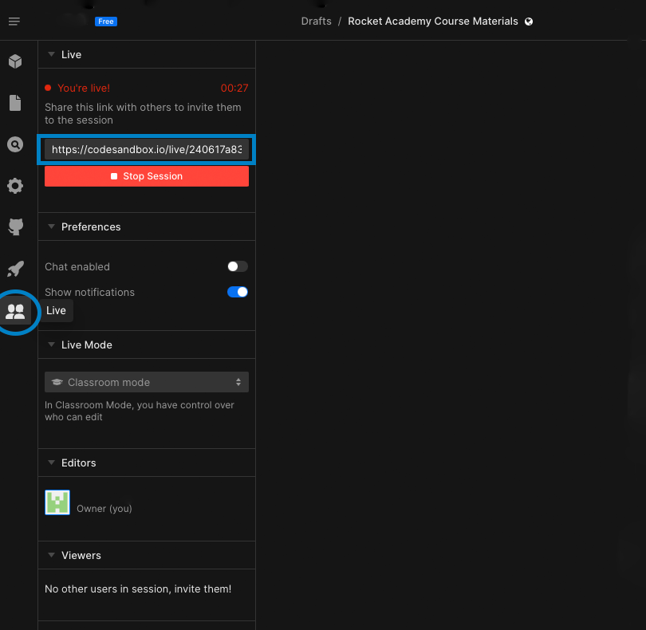
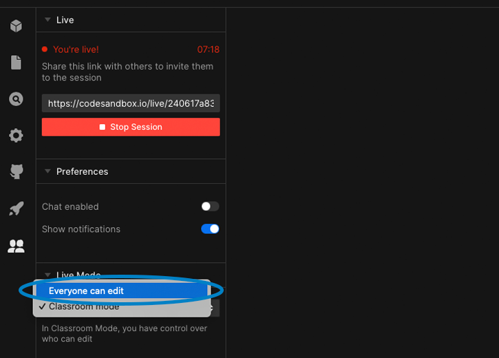

# 🧑🤝🧑 Pair Programming Instructions

For more information on What is Pair Programming, please refer to [Course Component](../course-methodology/course-components.md#pair-programming)&#x20;

1. Open up [CodeSandbox](https://codesandbox.io/signin?continue=/dashboard/home) and login&#x20;
2. Select your Rocket Academy Course Material Sandbox
3. Click the two person's icon and copy the link as shown in the blue box&#x20;

4\. Paste the link in Slack to your partner for the day&#x20;

5\. Your partner will click and join the link&#x20;

6\. Change the Live Mode to Everyone can edit

7\. Confirm by seeing that your partner and you are Editors!&#x20;

.png>)

Happy Coding!
