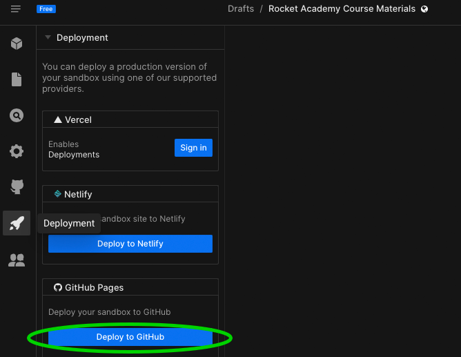
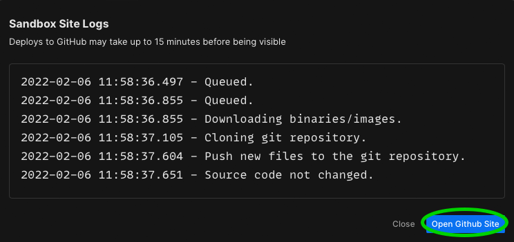

# 📩 Deployment

Like a real web application, code is useless if it's not deployed for people to use and enjoy! In Basics, we want our students to have something to show for when they graduate, as it is a testament to the effort and hard work put into learning programming!

### Instructions

1. Select your Rocket Academy Course Material Sandbox
2. Click the `Deployment` button (:rocket:)  and click  'Deploy to Github'




**What are GitHub Pages?**\
GitHub Pages are public web pages hosted and published through GitHub. You can use GitHub Pages to showcase some open source projects, host a blog, or even share your résumé. \
\
You can choose to deploy with other services, but since we already have a GitHub account, we can use the features made available to us.\
\
Read more [here](https://docs.github.com/en/pages/quickstart).


3\. You should see a pop-up, click on 'Open Github Site'



4\. You should see an error page, but do not worry. We are about to fix that.&#x20;

 (2).png>)

5\. Copy the current URL in the address bar. It should look something like:

```
https://<YOUR_GITHUB_USERNAME>.github.io/<SOME_RANDOM_HASH>
```

6 Add the following endpoint to the rest of your URL. Assuming that the files were not renamed, this directs the user to the appropriate webpage in your directory.

> For Project 1: Scissors Paper Stone
>
> ```
> /project1-sps/index.html
> ```
>
> Your full URL should look like:&#x20;
>
> ```
> https://<YOUR_GITHUB_USERNAME>.github.io/<SOMETHING>/project1-sps/index.html
> ```
>
>

> For Project 2: Beat That!
>
> ```
> /project2-beat-that/index.html
> ```
>
> Your full URL should look like:
>
> ```
> https://<YOUR_GITHUB_USERNAME>.github.io/<SOMETHING>/project2-beat-that/index.html
> ```
>
>

> For Project 3: BlackJack
>
> ```
> /project3-blackjack/index.html 
> ```
>
> Your full URL should look like:
>
> ```
> https://<YOUR_GITHUB_USERNAME>.github.io/<SOMETHING>/project3-blackjack/index.html 
> ```

