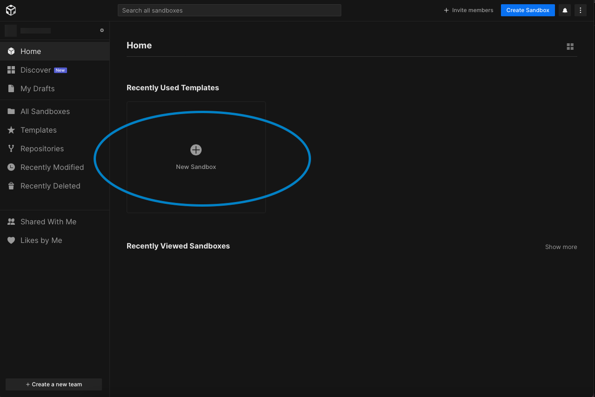
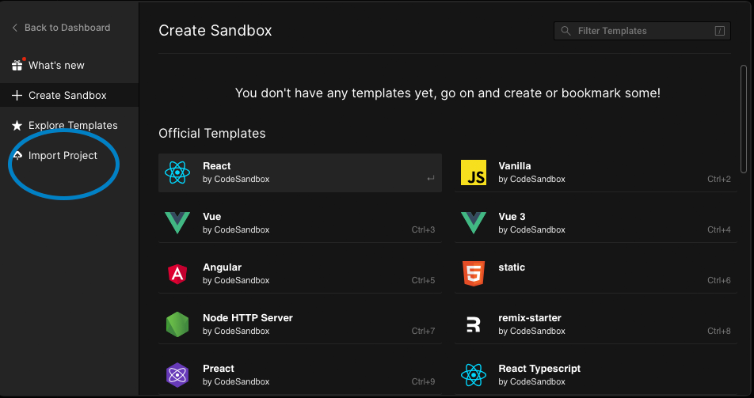

# ⏹ Course Setup

**Setup**&#x20;

If you have not logged in to CodeSandbox, you can login at  [**https://codesandbox.io/signin**](https://codesandbox.io/signin) **** After logging in, you should see the page below and click on 'New Sandbox'

Thereafter, click on 'Import Project'

Next, copy and paste [https://github.com/rocketacademy/basics-starter-code-2.0](https://github.com/rocketacademy/basics-starter-code-2.0) and click 'Import and Fork'

Next, click on the name and enter Rocket Academy Course Materials and press enter

 (1).png>)

Following that, Click on the Cat Icon on the left sidebar and click on 'Sign in'

.png>)

You should see a pop up and click on 'Authorize codesandbox' and the pop up should close thereafter

Under 'Export to new GitHub repository' enter RocketAcademyBasics into the repository name and click 'Create new repository on GitHub'

 (1).png>)

Last step would be to confirm that you have successfully created the repository. Check to see if you have your GitHub username as shown below

.png>)

Congrats, you are done with the setup. :tada::tada: see you for class! :relaxed:
