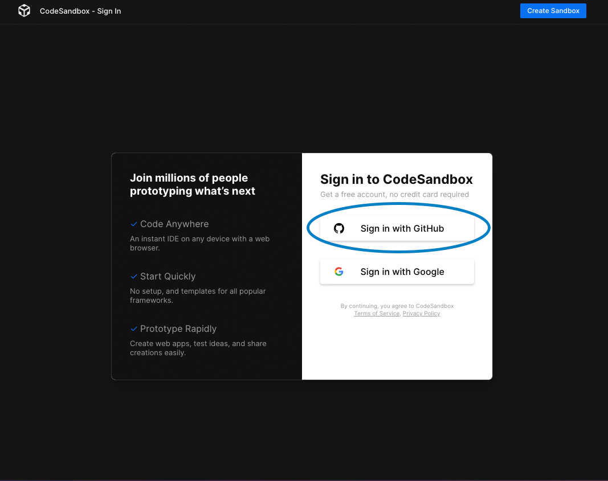

# ☝ Required Software Accounts

### GitHub

GitHub is the most popular code-hosting platform. Developers around the world use GitHub to share code and collaborate on projects. Rocket Academy's starter code and project templates are hosted on GitHub, and we will use GitHub in Coding Basics to download, host, and submit assignments. Each student will need a GitHub account to host and submit assignment code.

#### **Sign Up**

Go to [https://github.com/](https://github.com), click the Sign Up button and follow on-screen instructions.

### CodeSandbox

CodeSandbox allows developers to simply go to a URL in their browser to start coding. This not only makes it easier to get started, it also makes it easier to share. You can just share your created work by sharing the URL, others can then (without downloading) further develop on these sandboxes.\
For this basic course, all the coding will be done in CodeSandbox

#### **Sign Up**

Go to [**https://codesandbox.io/signin**](https://codesandbox.io/signin), click the **Sign in with GitHub** button and it will bring up a pop up

Key in your username and password that you have sign up from Github and press Sign In.

 (1).png>)

Click on Authorize codesandbox

Select your username and enter your display name and click Finish Sign up

 (1).png>)

Head over to Course Setup for the next set of instructions. You're almost done! :relaxed:
