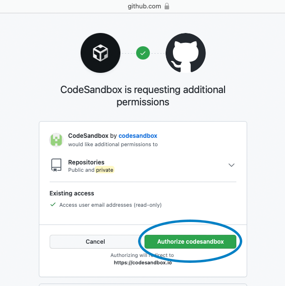

# ⏹ Initial Setup

* [ ] Head over to [Rocket Academy's Basics Starter Code](https://githubbox.com/rocketacademy/basics-starter-code-2.0). Confirm that the template that you've been directed to has the following headers.

.png>)

* [ ] You should see a repository of multiple folders that detail the coursework over the Basics Programme. The entry point of the repository (which is rendered on the in-built browser panel on the right) is `index.html` as highlighted.

.png>)

* [ ] What we need to do next is to make a copy of the Starter Code so that we do not edit the main repository that all other students rely on! (technically you can't). To do this, we will need to `Fork` this sandbox.&#x20;

.png>)

* [ ] By `Forking`, you are taking a copy of the repository at that point in time. This will create a copy and store it in a temporary state within CodeSandbox.&#x20;

> At this juncture, by forking the original repository (Rocket's), any changes to the original will not be reflected in the forked sandbox (yours). \
> \
> However, if you were to make any changes to your sandbox (be it through GitHub or another imported sandbox environment), the imported repository will always stay up to date with your latest commits and reflect the changes. This means that any change to your GitHub repository will be reflected immediately in the sandbox (yours).
>
> __[_CodeSandbox Documentation_](https://codesandbox.io/docs/importing#import-from-github)__

.png>)

* [ ] Complete the sign-up flow in order to save the forked sandbox! You can sign in with the Github account&#x20;

Next, click on the name and enter Rocket Academy Course Materials and press enter

 (1) (1).png>)

Following that, Click on the Cat Icon on the left sidebar and click on 'Sign in'

.png>)

You should see a pop up and click on 'Authorize codesandbox' and the pop up should close thereafter

Under 'Export to new GitHub repository' enter RocketAcademyBasics into the repository name and click 'Create new repository on GitHub'

 (1) (1).png>)

The last step would be to confirm that you have successfully created the repository. Check to see if you have your GitHub username as shown below

.png>)

Congrats, you are done with the setup. :tada::tada: see you in class! :relaxed:
