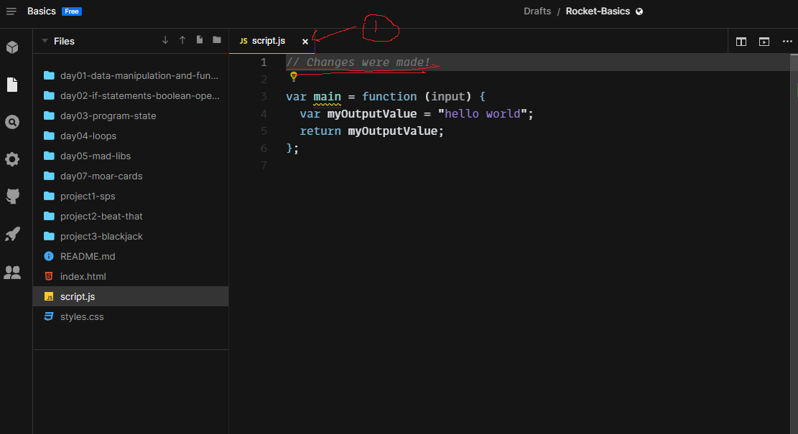
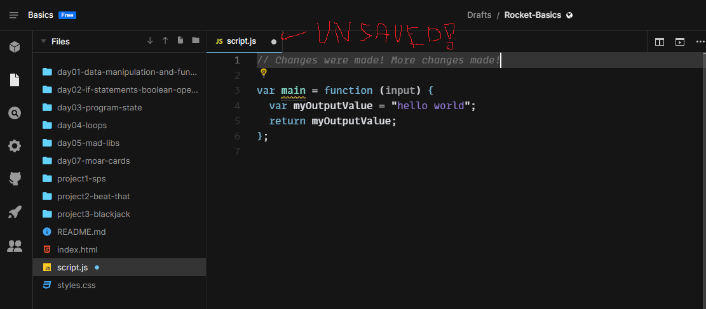
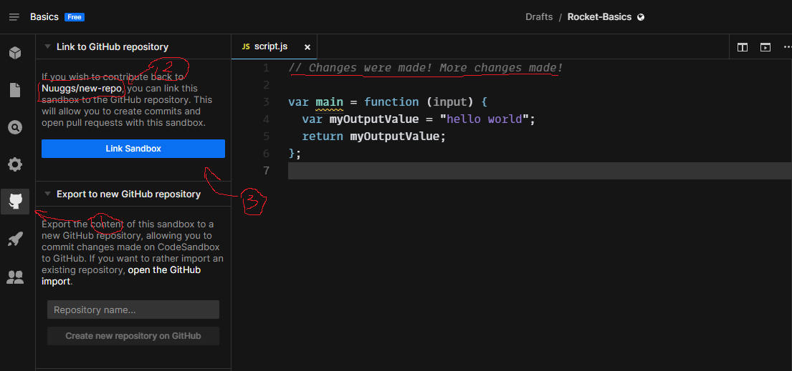
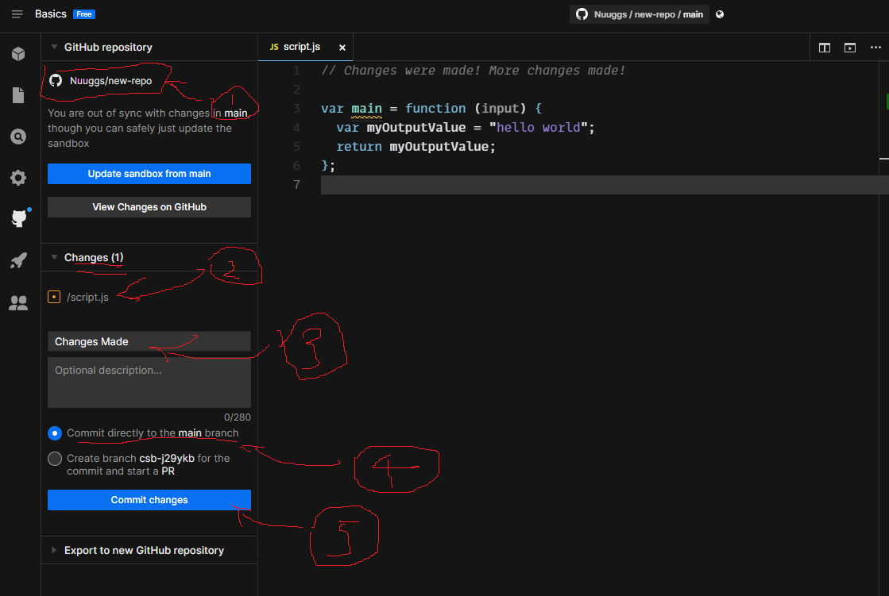
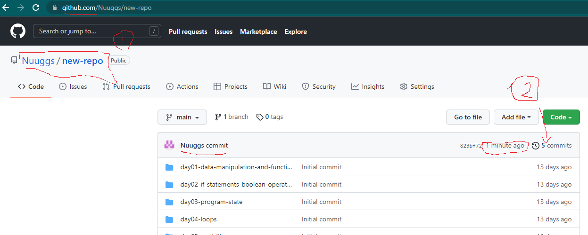
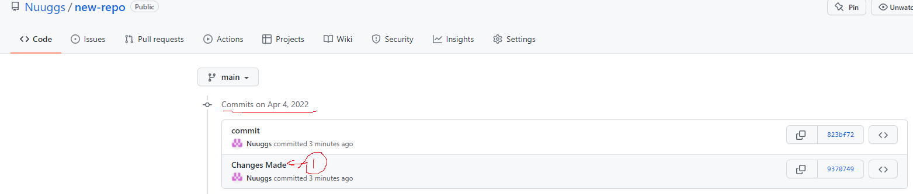

# 💼 Submitting Your Work

At appropriate junctures during the course, your SLs will request for your submission for the respective projects. You will need to submit **the latest 'commit'** that you have made for your project on **your section's Slack channel**, so that your SLs can give you feedback on your code.

Doing so would help facilitate code review, since our SLs have a lot of code to read! If you have a last-minute change to your code, you can resubmit the form with your updated PR link!

### Submission

* [ ] Submit your repo link on Slack. It should be in the following format:

`https://github.com/<USER>/<REPO_NAME>/`

## Guide

### 1. Save Your Changes

1. Check that your file is saved by looking for the "X" on the specific tab of the script.js file that you have been working on. This is in contrast to a filled "O" that indicates that a file is unsaved!

### 2. Link your Sandbox if it is not linked

1. Click on the GitHub tab on the left nav bar
2. Ensure that your repo **\<username>/\<repo-name>** is being called
3. Click on the "**Link Sandbox**" Button.

### 3. Commit Changes on Code Sandbox

1. Ensure that you're still in the **\<username>/\<repo-name>** format
2. Note that your changes made are specified
3. Give a summarized title of the changes that you have made
4. Ensure 'commit directly to the main branch' is selected
5. Click on the "**Commit Changes**" Button.

### 4. Check GitHub

1. Navigate to GitHub on your Google Chrome and access your repo.\
   **\*NOTE\* The URL at the top is what you share in your section Slack channel for submission**
2. Check that your commit is recorded. To check the details of the changes, click on the "## commits"

### 5. Check Changes (optional)

1. Click on the commit with the title your wrote earlier on Code Sandbox

1. Double check the changes you made in the specific file
2. Double check that you are in the correct repo
